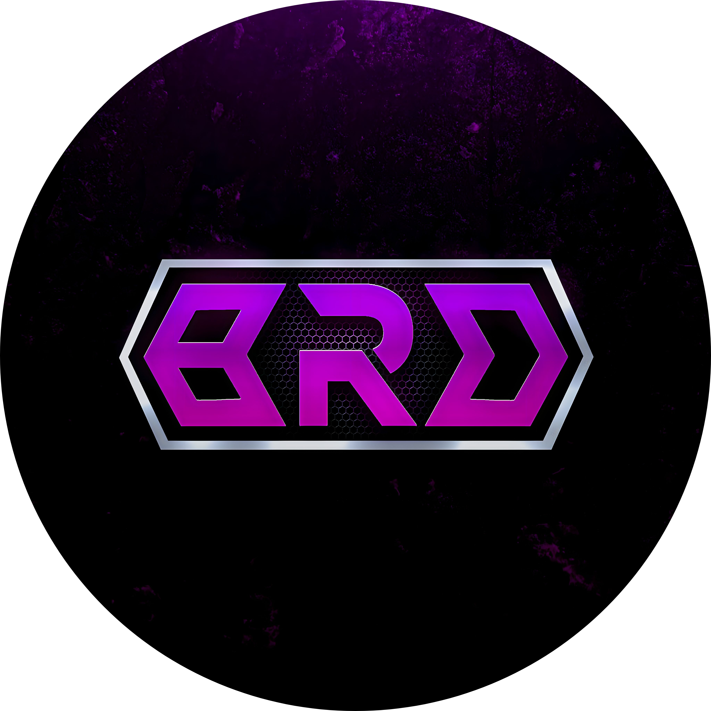

  
<h1 align="center">Hi 👋, I'm Brd</h1>
<h3 align="center">A passionate Js developer from India</h3>

# 💫 About Me:
- 🔭 I’m currently studying

- 🤝 I’m looking for help with my future projects

- 🌱I’m working on [Fenix](https://dsc.gg/fenixx)

- 🧑‍💻 I’m currently learning **Js, Css, Python, Html**

- 👨‍💻 All of my projects are available at [hehebrd](https://hehebrd.vercel.app)

- 💬 Kerala,India
  
- 🧿 I'm 20

## 🌐 Socials:
   

# 💻 Tech Stack:
                                                                 
# 📊 GitHub Stats:
 
 

### ✍️ Random Dev Quote

### 🔝 Top Contributed Repo

---

  

<!-- Proudly created with GPRM ( https://gprm.itsvg.in ) -->
